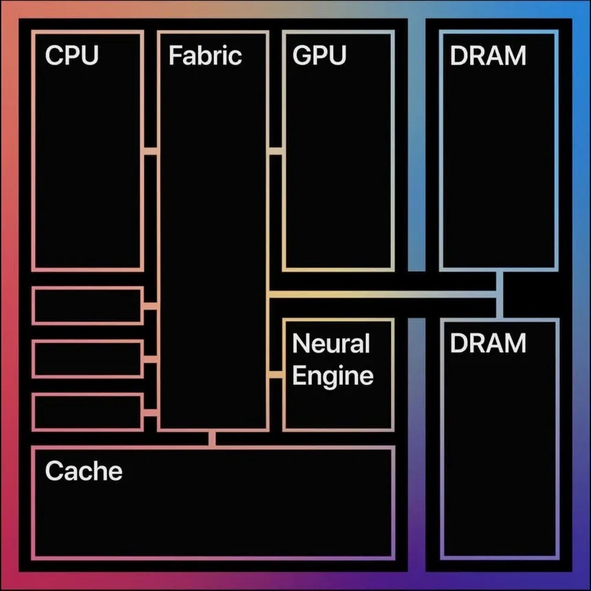

# Architecture Learning
As I was trying to make my architecture I realized that in order to build an architecture I needed first to understand what is an architecture.  
First I decided to learn from different architectures that I'm learning and inspiring my architecture from.
# M-Chip Series for Mac

*1.1 M1 Chip Diagram*  
This is the one I am learning first as I really think the M-Chip changed the way to make chips, but what really is the M-Chip?  
To make it simple the M-Chip is a chip containing everything inside it, a System on Chip (SoC), which includes everything close to each other:
- A Central Processing Unit (CPU)
- A Graphics Processing Unit (GPU)
- A Neural Engine (Matrix Accelerator)

Then for me the 3 most interesting things from this:
- Unified Cache
- Unified Random Access Memory (DRAM)
- A Fabric connecting and arbitrating everything together.

Having all of this right next to each other makes a huge difference as it optimizes everything. Imagine your computer, whenever you have a game open you CPU's is constantly copying the processed memory to the GPU's VRAM, a process that kills efficiency.
As you notice in this design they're both connected, so if the CPU processes memory and writes it back to the DRAM the GPU has direct access to it avoiding unnecessary copies between two memories.
  
Now one of the things I studied the most:
## The Fabric
When I first saw this diagram I didn't know what the Fabric was doing, as you can see it on *Image 1.1* everything is connected to the Fabric.
To make it simple the Fabric is like a big highway for everything to get or set what they need.   
If the CPU needs to access to tell the GPU to draw something, it goes through the Fabric to get it.  
If the GPU needs to access to the VRAM to retrieve a texture, it goes through the fabric.  
This way you avoid connecting everything through complicated buses and instead letting the Fabric manage it by setting priorities to each task asked by the processors/accelerators.

